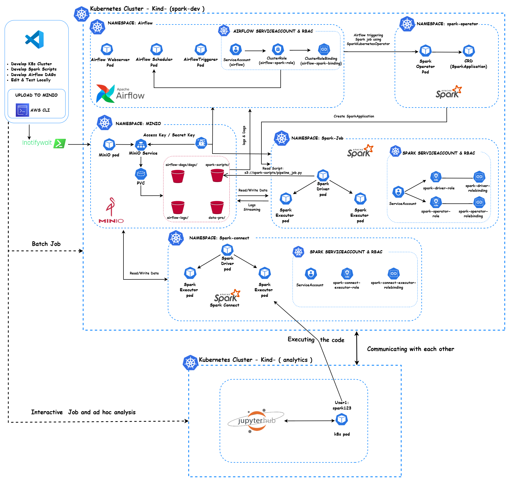
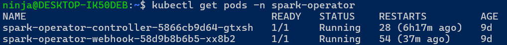
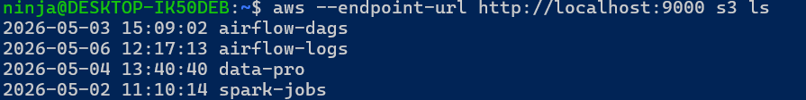
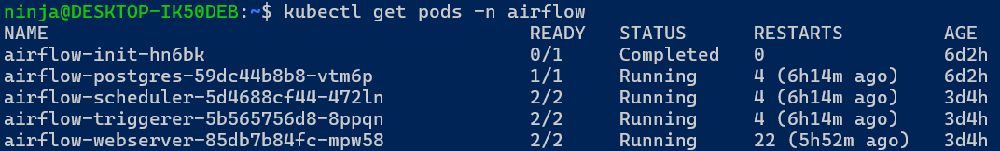
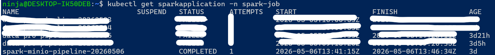
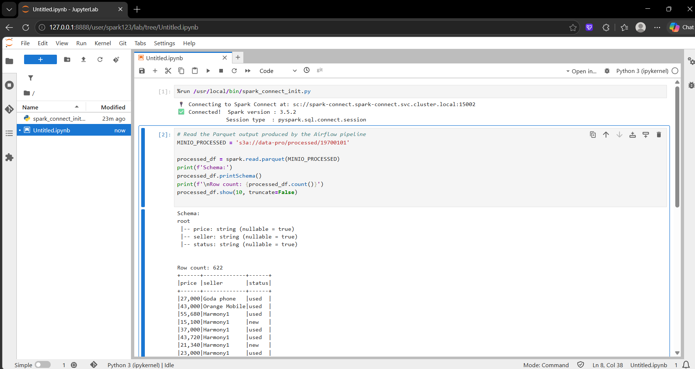

# Project: End-to-End Data Engineering Platform on Multi-Cluster Kubernetes
## Description:
- Designed and implemented a cloud-native distributed data platform on Kubernetes using Spark Operator, Apache Airflow, JupyterHub, and S3-compatible storage (MinIO/AWS S3). Built a multi-cluster architecture where separate Kubernetes clusters were dedicated for batch processing workloads and analytics/ad-hoc analysis workloads to improve scalability and workload isolation. Developed scalable ETL pipelines and automated data workflows using Airflow with SparkKubernetesOperator to orchestrate Spark jobs. Integrated JupyterHub with Spark Connect to enable interactive analytics and ad-hoc data exploration for multiple users within the platform.
- Both clusters share the same `kind` Docker bridge network, so nodes can reach each other by IP directly. Spark Connect and MinIO are exposed as `NodePort` services on `spark-dev-worker`, and the notebook pods in the analytics cluster connect to them by IP.

> **A fully automated, cloud-native data engineering stack on a local Multi-Cluster Kind cluster.**  
> One command deploys everything. Scripts and DAGs live in MinIO — no `hostPath`, no `docker cp`, no manual syncing.

[](https://spark.apache.org)
[](https://airflow.apache.org)
[](https://min.io)
[](https://kubernetes.io)
[](https://https://z2jh.jupyter.org)


---

## 📋 Table of Contents

- [Architecture](#-architecture) 
- [Batch Job Cluster](#-batch-job-cluster)
- [Analytics Job Cluster](#-analytics-job-cluster)
- [Technology Stack](#-technology-stack)
- [Project Structure](#-project-structure)
- [Quick Start](#-quick-start)
- [setup.sh — Command Reference](#-setupsh--command-reference)
- [Kubernetes Namespaces](#-kubernetes-namespaces)
- [MinIO Buckets](#-minio-buckets)
- [Custom Spark Image](#-custom-spark-image)
- [Live Update Workflow](#-live-update-workflow)
- [Verification Commands](#-verification-commands)
- [Challenges and Solutions](#-challenges-and-solutions)

---

## 🏗 Architecture


### Data flow at a glance

| Flow | Path |
|------|------|
| 📝 Script delivery | `pipeline_job.py` → `s3://spark-jobs/` → Spark downloads via `s3a://` at job start |
| 📅 DAG delivery | `spark_pipeline_dag.py` → `s3://airflow-dags/dags/` → `mc-sync` sidecar mirrors every 10s |
| ⚙️ Spark config | `pipeline.yaml` → `s3://airflow-dags/spark-apps/` → DAG fetches at task runtime |
| 📥 Data input | Raw files in `s3://data-pro/raw/` |
| 📤 Data output | Processed Parquet in `s3://data-pro/processed/{run_date}/` |
| 📋 Task logs | Streamed to `s3://airflow-logs/logs/` in real time — survive pod deletion |

---
## 🛠 Batch Job Cluster
- Batch Job Cluster include spark operator + minio + aifrlow + spark connect 
## 🛠 Technology Stack

| Component | Version | Role |
|-----------|---------|------|
| 🐳 Kind | 0.22+ | Kubernetes in Docker (local cluster) |
| ☸️ Kubernetes | 1.29 | Container orchestration |
| ⚡ Apache Spark | 3.5.0 | Distributed data processing |
| 🎛 Spark Operator | v2.5.0 | Manages `SparkApplication` CRDs |
| 🌬 Apache Airflow | 3.2.1 | Workflow orchestration |
| 🪣 MinIO | 2024-01-16 | S3-compatible object storage |
| 🔌 hadoop-aws | 3.3.4 | S3A filesystem connector |
| ☕ aws-java-sdk-bundle | 1.12.262 | AWS SDK (paired with hadoop-aws 3.3.4) |
| 🐘 PostgreSQL | 15-alpine | Airflow metadata database |
| 🔄 MinIO Client (mc) | 2024-01-13 | DAG sync sidecar |

---

## 📁 Project Structure

```
spark-minio-pipeline/
│
├── 🚀 setup.sh                              ← One-command full deployment
├── 🐳 Dockerfile                            ← Custom Spark image with S3A JARs
├── 🔑 aws.env                               ← MinIO credentials (not committed)
│
├── 📂 kind/
│   └── kind-cluster.yaml                    ← Kind cluster config
│
├── 📂 jupyterhub/
│   ├── Dockerfile.notebook                  ← scipy-notebook + pyspark==3.5.0 
│   ├── jupyterhub-config.yaml               ← Z2JH Helm values
│   └── spark_connect_init.py                ← %run helper for notebooks
│
├── 📂 namespaces/
│   └── namespaces.yaml                      ← All 4 namespaces
│
├── 📂 rbac/
│   ├── spark-connect-rbac.yaml                SA + cross-namespace Role/RoleBinding  
│   └── spark-rbac.yaml                      ← ServiceAccount, Role, RoleBinding
│                                                 
│
├── 📂 minio/manifests/
│   ├── 01-minio-secret.yaml
│   ├── 02-minio-pv-pvc.yaml
│   ├── 03-minio-deployment.yaml
│   └── 04-minio-service.yaml
│
├── 📂 spark-job/manifests/
│   ├── 01-spark-scripts-pv.yaml
│   ├── 02-minio-spark-secret.yaml           ← MinIO credentials in spark-job ns
│   └── 03-spark-application.yaml            ← Manual test SparkApplication
│   📂 spark-job/scripts
│        └── pipeline_job.py
│
├── 📂 spark-scripts/
│   └── pipeline_job.py                      ← PySpark job: raw → select → processed
│
├── 📂 spark-connect/
│   ├── Dockerfile.spark-connect-server        aagumin image + S3A JARs merged
│   ├──minio-spark-connect-secret.yaml         ← MinIO credentials secret
│   └──spark-connect-values.yaml               ← Helm values (NodePort, S3A, image)
│
├── 📂 spark-connect-custom-chart/            ← Cloned aagumin Helm chart (patched)
│
├── 📂 airflow-dags/
│   └── spark_pipeline_dag.py                ← Airflow DAG: fetch → submit → monitor
│   └── 📂 airflow-dags/spark-apps
│        └── spark-application.yaml
│
└── 📂 airflow/
    └── airflow_remote_logs.yaml             ← Full Airflow deployment with remote logging
```

---

## ⚡ Quick Start

### 1 — Only Docker is required upfront

```bash
docker info   # must show Docker running
```

Everything else (kind, kubectl, helm, awscli, inotify-tools) is installed automatically.

### 2 — Create `aws.env`

```bash
cat > aws.env << 'EOF'
AWS_ACCESS_KEY_ID=YourName
AWS_SECRET_ACCESS_KEY=YourPass
AWS_DEFAULT_REGION=us-east-1
AWS_DEFAULT_OUTPUT=json
EOF
```

### 3 — Run the installer

```bash
sudo ./setup.sh
```

Takes ~5 minutes. Installs tools → creates cluster → deploys all components → uploads files → submits smoke test.

### 4 — Add Airflow connection

Open **http://localhost:8080** → **Admin → Connections → +**  
*(details in [Airflow Connection Setup](#-airflow-connection-setup))*

### 5 — Trigger the pipeline

```
Airflow UI → DAGs → spark_minio_pipeline_v1 → ▶ Trigger DAG
```

---

## 🎮 setup.sh — Command Reference

```bash
sudo ./setup.sh              # Full deploy (idempotent — safe to re-run)
sudo ./setup.sh --recreate   # Delete cluster and redeploy from scratch
sudo ./setup.sh --teardown   # Destroy everything cleanly
sudo ./setup.sh --sync       # Start live file-sync watchers only
```

### Steps performed by `./setup.sh`

| Step | Action |
|------|--------|
| **0** | Install `kind`, `kubectl`, `helm`, `awscli`, `inotify-tools` if missing |
| **0b** | Load `aws.env` and verify MinIO connectivity |
| **0c** | Create MinIO buckets (`spark-jobs`, `airflow-dags`, `airflow-logs`, `data-pro`) |
| **1** | Create Kind cluster (skip if already exists) |
| **2** | Apply all 4 namespaces |
| **3** | Install Spark Operator via Helm, patch to watch `spark-job` namespace |
| **4** | Apply RBAC (ServiceAccount, Role, RoleBinding) |
| **5** | Deploy MinIO and wait for Ready |
| **6** | Create MinIO credentials Secret in `spark-job` namespace |
| **7** | Build `spark-minio-s3a-custom:3.5.0` and load into Kind |
| **8** | Upload Spark script, DAG, and SparkApp YAML to MinIO |
| **9** | Deploy Airflow, wait for init job and all pods |
| **10** | Submit smoke-test `SparkApplication`, poll until `COMPLETED` |

## 🔄 Live Update Workflow


### Automatic (recommended during development)
### `--sync` mode

Starts two `inotifywait` background watchers that upload on every file save:

```bash
sudo ./setup.sh --sync

```

Press `Ctrl+C` to stop both watchers.

---

## 🗂 Kubernetes Namespaces

| Namespace | Contents |
|-----------|----------|
| `spark-operator` | Spark Operator controller + webhook |
| `minio` | MinIO StatefulSet + services |
| `spark-job` | Spark driver + executor pods |
| `airflow` | Scheduler, webserver, triggerer, PostgreSQL |

---

## 🪣 MinIO Buckets

| Bucket | Contents | Used by |
|--------|----------|---------|
| `spark-jobs` | `pipeline_job.py` | Spark driver (`s3a://`) |
| `airflow-dags` | `dags/` DAG files · `spark-apps/` YAML | Airflow mc-sync + DAG S3Hook |
| `data-pro` | `raw/` input · `processed/` output | PySpark script |
| `airflow-logs` | Task execution logs | Airflow remote logging |

| | Value |
|-|-------|
| 🌐 API | http://localhost:9000 |
| 🖥 Console | http://localhost:9001 |

---

## 🐳 Custom Spark Image

The base `apache/spark:3.5.0` has no S3A connector. We bake it in at build time:

```dockerfile
FROM apache/spark:3.5.0-scala2.12-java11-python3-ubuntu
USER root

RUN mkdir -p /opt/spark/jars

RUN curl -fL -o /opt/spark/jars/hadoop-aws.jar \
    https://repo1.maven.org/.../hadoop-aws/3.3.4/hadoop-aws-3.3.4.jar

RUN curl -fL -o /opt/spark/jars/aws-java-sdk-bundle.jar \
    https://repo1.maven.org/.../aws-java-sdk-bundle/1.12.262/aws-java-sdk-bundle-1.12.262.jar

RUN chown -R 185:185 /opt/spark/jars/

RUN mkdir -p /opt/spark/conf && \
    echo "spark.driver.extraClassPath   /opt/spark/jars/*" >> /opt/spark/conf/spark-defaults.conf && \
    echo "spark.executor.extraClassPath /opt/spark/jars/*" >> /opt/spark/conf/spark-defaults.conf

ENV SPARK_CLASSPATH="/opt/spark/jars/*"
USER 185
```

> ⚠️ **Version pairing:** `hadoop-aws 3.3.4` requires `aws-java-sdk-bundle 1.12.262`.  
> Mismatching versions causes `NoSuchMethodError` at runtime.


---

## 🔍 Verification Commands

```bash


# Spark Operator
kubectl get pods -n spark-operator
kubectl logs deploy/spark-operator-controller -n spark-operator | tail -20
```


```bash
# Minio
kubectl get pods -n minio
```


```bash
# Buckets
curl -s http://localhost:9000/minio/health/ready
aws --endpoint-url http://localhost:9000 s3 ls
```

```bash
# Airflow
kubectl get pods -n airflow
kubectl logs deploy/airflow-scheduler -n airflow -c mc-sync --tail=20
kubectl exec -n airflow deploy/airflow-scheduler -c scheduler -- airflow dags list
```

```bash
# Spark job
kubectl get sparkapplication -n spark-job 
```


---

## 🩺 Challenges and Solutions

### 1- Spark Image Missing Hadoop AWS Dependencies

`Challenge`

The default Spark image used by SparkApplication did not contain:
- Hadoop AWS modules
- hadoop-aws
- aws-java-sdk
- S3A filesystem libraries
As a result, Spark failed when trying to access:
```yaml
 mainApplicationFile: s3a://
```
Even after adding Spark configurations, the required classes and filesystem drivers were still unavailable inside the container.

`Solution`

I built a custom Spark Docker image that included:
- Hadoop AWS dependencies
- S3A filesystem support
- required JAR files
- compatible Spark & Hadoop versions
Then I pushed the image into the Kind cluster and updated the SparkApplication image configuration.

### 2- Spark Operator Volume Mount Limitation

`Challenge`

I initially attempted to use:
- hostPath
- PersistentVolume (PV)
- PersistentVolumeClaim (PVC)
to mount local Spark scripts into Spark pods.
However, Spark Operator does not properly support mounting local volumes for the mainApplicationFile in the latest Spark Operator workflow, especially in dynamic Kubernetes environments.
```yaml
 mainApplicationFile: local:///opt/spark/scripts/test_spark_job.py 
```
This created major issues when trying to execute local PySpark scripts.

`Solution`

Instead of relying on local Kubernetes volumes, I redesigned the architecture using MinIO as S3-compatible object storage.
I stored:
- Spark scripts
- Airflow DAGs
 -logs
- processed data
inside MinIO buckets.
Spark applications then loaded scripts directly using:
```yaml
s3a://spark-scripts/pipeline_job.py
```

### 3- AWS CLI Synchronization Performance Problem

`Challenge`

To implement live development, I initially used AWS CLI sync commands to upload local files into MinIO.
However, AWS CLI continuously scanned all local files repeatedly even when no changes occurred.

Problems:
- High CPU usage
- Heavy filesystem scanning
- Delayed synchronization
- Not true real-time updates

`Solution`

I replaced the polling-based approach with Linux inotifywait.
`inotifywait` listens for filesystem events in real time and immediately triggers synchronization only when a file is modified.

### 4- Airflow & Spark Logs Disappearing After Job Completion

`Challenge`

One of the biggest issues was log persistence.
After Spark jobs finished, Kubernetes automatically deleted driver and executor pods.

As a result:
- Spark logs disappeared
- Airflow UI could no longer display logs
- debugging became very difficult

`Solution`

I implemented centralized remote logging using MinIO.

### 5- AWS CLI Could Not Reach MinIO

`Challenge`

AWS CLI initially failed to connect to MinIO running inside Kubernetes.
The issue was that the MinIO service was configured as: `ClusterIP`

`Solution`

I changed the MinIO service type from: `ClusterIP` to: `NodePort`
This exposed MinIO outside the cluster and allowed AWS CLI running on the local machine to communicate with MinIO successfully.

### 6- Spark Operator Namespace Watching Issue 
`Challenge`

At the beginning, the Spark Operator controller was watching the default namespace only.
When I tried to submit a SparkApplication inside the spark-job namespace, the application failed because the operator could not detect or manage resources outside the default namespace.

`Solution`

I reconfigured the Spark Operator controller to watch the spark-job namespace explicitly.
This ensured that all SparkApplication resources were properly monitored and managed by the operator.

---
## 📊 Analytics Job Cluster
**A dedicated analytics cluster that connects to the existing `spark-dev` data platform.**
- Include Jupyterhub + Users

### Cross-Cluster Communication

Both clusters share the same `kind` Docker bridge network, so nodes can reach each other by IP directly. Spark Connect and MinIO are exposed as `NodePort` services on `spark-dev-worker`, and the notebook pods in the analytics cluster connect to them by IP.

| Service | spark-dev NodePort | Used by |
|---------|-------------------|---------|
| Spark Connect gRPC | `32002` | Notebook `SparkSession.builder.remote()` |
| Spark UI | `32004` | Browser debugging |
| MinIO API | `30900` | Direct `boto3` / `s3fs` access |
| MinIO Console | `30900` | Browser MinIO UI |

---

## 🛠 Technology Stack

| Component | Version | Cluster | Role |
|-----------|---------|---------|------|
| Apache Spark | 3.5.0 | spark-dev | Distributed compute |
| Spark Connect | 3.5.0 | spark-dev | gRPC session server |
| aagumin/spark-connect-kubernetes | 1.5.1 | spark-dev | Helm chart for Connect server |
| MinIO | 2024-01-16 | spark-dev | S3-compatible object storage |
| JupyterHub | 3.3.8 | analytics | Multi-user notebook platform |
| PySpark client | 3.5.0 | analytics | Notebook-side Spark client |
| Kind | 0.32.x | both | Kubernetes in Docker |

---

### 1 — Deploy everything
```bash
sudo ./setup-analytics-job-cluster.sh
```
- Applies RBAC and secrets on spark-dev
- Builds and loads the Spark Connect server image
- Patches the aagumin chart (ZGC flags + NodePort)
- Deploys Spark Connect on spark-dev with NodePort 32002
- Creates the analytics Kind cluster
- Builds and loads the notebook image
- Deploys JupyterHub with the spark-dev-worker IP pre-wired

---
### 2 — Access JupyterHub 

Open **http://localhost:8888** — The username & password: `spark123`

---
### 3 — Connect to Spark from a notebook
```python
%run /usr/local/bin/spark_connect_init.py
# spark session is now available globally

df = spark.read.parquet("s3a://data-pro/processed/")
df.show()
```
---
## 🔍 Useful Commands

```bash
# ── Check the status of the Spark Connect pods ───────────────────────────────────────────────────
kubectl get pods -n spark-connect

# ── Check the services in the spark-connect namespace ───────────────────────────────────────────────────
kubectl get svc -n spark-connect

# ── Check the endpoints for the spark-connect service ───────────────────────────────────────────────────
kubectl get endpoints spark-connect -n spark-connect
```


```bash
# ── Check the status of the JupyterHub pods ───────────────────────────────────────────────────
kubectl get pods -n jupyterhub
```


```bash
# ── Switch cluster contexts ───────────────────────────────────────────────────
kubectl config use-context kind-spark-dev
kubectl config use-context kind-analytics

# ── Spark Connect server logs ─────────────────────────────────────────────────
kubectl logs -n spark-connect -l app.kubernetes.io/name=spark-connect \
  --context kind-spark-dev --tail=50

# ── Watch executor pods spawn when notebook runs Spark ────────────────────────
kubectl get pods -n spark-job --context kind-spark-dev -w

# ── JupyterHub user pods ──────────────────────────────────────────────────────
kubectl get pods -n jupyterhub --context kind-analytics


```
## JupyterHub UI

</div>
